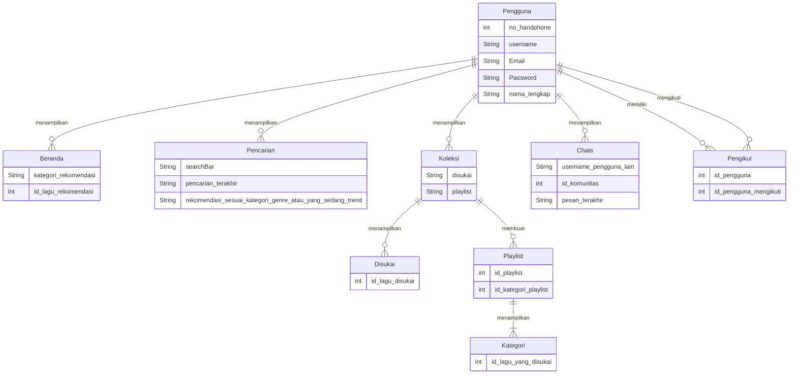
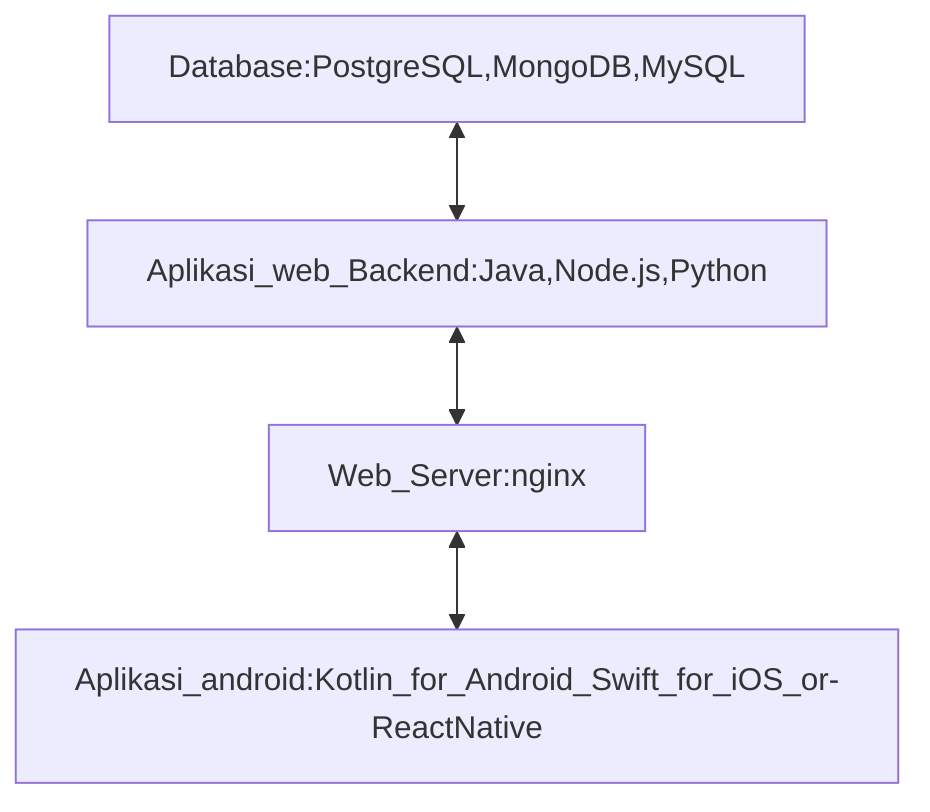

Membuat aplikasi Musik dan Podcast

## 1.1 Latar Belakang

Saat ini perkembangan teknologi begitu pesat terutama internet, internet merevolusi kehidupan kita dalam banyak hal, termasuk cara kita mendengarkan musik. Jika kita mengingat 20 tahun yang lalu kita semua memiliki pemutar MP3 atau CD, tetapi sekarang kita dapat berlangganan aplikasi streaming musik dan semua musik dapat kita putar hanya dengan ujung jari kita, apa pun apapun kesukaan musik kita. Saat ini jumlah pengguna di industri streaming musik diperkirakan akan tumbuh menjadi 913,2 juta pengguna pada tahun 2025, menurut Statista . Dan pendapatan dari segmen ini diproyeksikan tumbuh pada tingkat tahunan (CAGR 2021-2025) sebesar 10,08% hingga tahun 2025. Maka dari itu penggunaan aplikasi musik akan terus meningkat juga, sehingga akan membuka banyak peluang untuk mencoba bersaing dalam perkembangan teknologi informasi di bidang musik itu.

## 1.2. Deksripsi Teknologi Informasi

Aplikasi yang akan saya buat yaitu sebuah aplikasi Musik dan podcast yang akan diberi nama Mr MuCast yang mana nanti pengguna dapat mencari dan mendengarkan music atau podcast yang diinginkan untuk menemani sebelum tidur, makan, belajar atau aktivitas lainnya. Selain itu di aplikasi tersebut saya akan media untuk berkomunikasi antara pengguna l dan pengguna lainnya, bahkan dapat membuat suatu komunitas atau grup sehingga setiap pengguna dapat berkomunikasi dan berbagi musik kepada pengguna lain atau komunitasnya. Dan selain berbagi musik, pengguna juga dapat mendengarkan lagu secara bersamaan dengan komunitas atau pengguna lain.

## 1.3. Branding

Branding dari aplikasi yang akan saya buat meliputi:

Merk : Mr MuCast  
Nama merk Mr MuCast tersebut diambil dari inisial nama saya sendiri, yang mana "Mr" yaitu "Muhammad Ridwan Nur Ihsan" yang diambil dari 2 huruf depan nama saya, dan dapat diartikan juga sebagai "Tuan" jika diterjemahkan dari bahasa Inggris. Dan "MuCast" itu sendiri singkatan dari Music & PodCast.

Tagline: Demus membuat gembira terus menerus.

Campaign: aplikasi yang dapat menemani aktivitas sehari-hari untuk kamu pendengar music dan podcast sejati. Simpel, mudah, dan yang pasti silaturahmi tidak akan putus walau tanpa meminjam seratus, karena dapat berkomunikasi terus menerus.

Target user: Usia 7+
- Untuk para pendengar musik & podcast sejati
- Untuk yang ingin mendengarkan musik & podcast dengan mudah dan nyaman
- Seorang yang ingin berbagi musik kesukaannya
- Seorang yang ingin mendengarkan lagu bersama-sama
- Seorang yang tidak ingin silaturahminya terputus
- Seorang yang ingin berkomusikasi dengan mudah

User experience theme:
- Aplikasi menarik
- Mudah digunakan
- Tampilan yang simple
- Fitur yang melimpah
- Menyenangkan
- Warna: dark blue yang tidak akan membuat mata cepat lelah

Inspirasi :  
.jpeg?raw=true)
.jpeg?raw=true)

## 2. User Story

Sebagai | Yang dapat dilakukan | sehingga | Priorotas
---|---|---|---
Pengguna | Mencari musik | Dapat Mencari musik yang di inginkan | ⭐⭐⭐⭐⭐
Pengguna | Mencari podcast | Dapat Mencari podcast yang di inginkan | ⭐⭐⭐⭐⭐
Pengguna | mendengarkan musik | Dapat mendengarkan musik dengan mudah dan nyaman | ⭐⭐⭐⭐⭐
Pengguna | mendengarkan podcast | Dapat mendengarkan podcast dengan mudah dan nyaman | ⭐⭐⭐⭐⭐
Pengguna | Membuat profile | Dapat membuat atau melengkapi profile | ⭐⭐⭐⭐
Pengguna | Melikat artis profile | Dapat melihat prifile artis | ⭐⭐⭐⭐
Pengguna | Berkomunikasi | Dapat berkomunikasi dengan pengguna lain | ⭐⭐⭐⭐
Pengguna | Membuat komunitas atau grup | Dapat membuat komunitas dengan 2 pengguna lain atau lebih | ⭐⭐⭐
Pengguna | Melihat lirik | Dapat mendengarkan sambil membaca lirik yang disediakan | ⭐⭐⭐⭐
pengguna | Berbagi musik | Dapat berbagi musik antara 1 pengguna dengan pengguna lain | ⭐⭐⭐
Pengguna | Mendengar bersama | 2 pengguna atau dalam komunitas dapat mendengarkan lagu yang sama | ⭐⭐⭐
Pengguna | Berteman | Setiap pengguna dapat saling mengikuti | ⭐⭐⭐
Pengguna | Menyukai lagu | Setiap pengguna dapat menyukai lagu yang disuka| ⭐⭐⭐
Pengguna | Membuat playlist | Dapat membuat 1 atau lebih playlist | ⭐⭐⭐

## 3. Struktur Data

## 4. Arsitektur Sistem
Versi ideal :

Versi biasa :

## 5. Teknologi, Library, dan Framework

Teknologi yang akan saya gunakan dalam pembuatan aplikasi ini diantaranya yaitu menggunakan Android Studio sebagai aplikasi utama untuk membuat, menjalankan program, serta backend dan lainya. Dan bahasa yang saya gunakan yaitu menggunakan bahasa Java

## 6. Desain User Experience dan User Interface

## 7. Demonstrasi Video

Link youtube nya

## 8. Bagaimana mesin komputasi dan sistem operasi berperan dalam produk teknologi informasimu ?

Link youtube nya di detik jawaban ini

## 9. Bagaimana algoritma, struktur data, dan bahasa pemrograman berperan dalam produk teknologi informasimu ?

Link youtube nya di detik jawaban ini

## 10. Bagaimana metode pengembangan perangkat lunak / Software Development Life Cycle berperan dalam produk teknologi informasimu ?

Link youtube nya di detik jawaban ini

## 11. Bagaimana database / sistem basis data berperan dalam produk teknologi informasimu ?

Link youtube nya di detik jawaban ini
